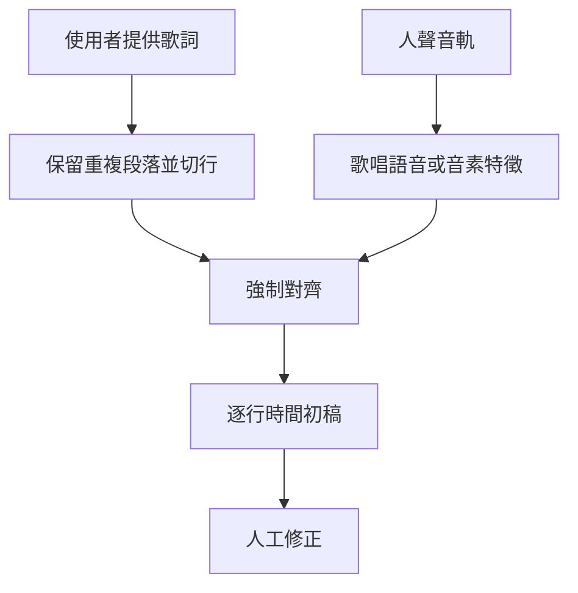
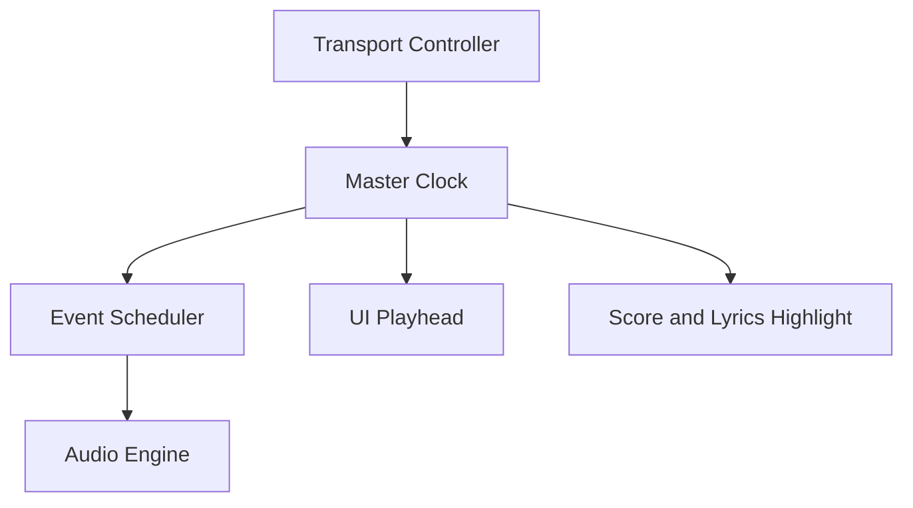

# GuitarScribe 追加規格：歌詞與按譜演奏

> 文件類型：GuitarScribe 開發交接追加規格  
> 文件版本：v1.0  
> 建立日期：2026-09-05  
> 實作狀態：需求已確認，尚未實作  
> 對應主文件：`GuitarScribe_Web_UI_AI_Handoff.md`  
> 對應追加文件：`GuitarScribe_UI_Key_and_Chord_Voicings_Addendum.md`

## 閱讀順序

下一個 AI Session 必須依序閱讀：

1. `GuitarScribe_Web_UI_AI_Handoff.md`
2. `GuitarScribe_UI_Key_and_Chord_Voicings_Addendum.md`
3. `GuitarScribe_Lyrics_and_Score_Playback_Addendum.md`

本文件追加「歌詞」與「按譜演奏」功能。若三份文件在這兩個範圍出現差異，以本文件為準；其他範圍仍以主文件及前一份追加文件為準。

---

## 1. 追加功能摘要

GuitarScribe 新增兩組正式功能：

1. **歌詞匯入、編輯、對時與跟唱顯示**；
2. **按譜演奏，包括合成播放、原曲同步及練習模式**。

產品目標不是第一版就從任何錄音完美辨識完整歌詞，而是先建立可靠、可修正的流程：

> 使用者貼上歌詞或匯入 LRC，系統協助逐行對時；播放原曲或合成樂譜時，歌詞、和弦、小節與主旋律會同步高亮。

按譜演奏的第一版是「由系統播放產生的和弦、指型、刷奏節奏、主旋律及節拍器」，不是用麥克風判斷使用者彈奏是否正確。即時聆聽與評分列為後續獨立功能。

---

## 2. 已確認的產品決策

### 2.1 第一版歌詞功能

- 支援使用者貼上純文字歌詞。
- 支援匯入 `.lrc`。
- 支援逐行時間戳。
- 系統可根據歌曲結構、音訊與既有時間戳提出自動對時初稿。
- 使用者可播放、暫停並替目前歌詞行打時間點。
- 使用者可拖曳歌詞行的開始與結束位置。
- 播放時高亮目前歌詞行。
- 歌詞可與和弦、小節共同顯示。
- 原始匯入文字與使用者修正版分開保存。
- 支援匯出 LRC、JSON 與含歌詞的 ChordPro。

### 2.2 第一版不做的歌詞功能

- 不自動抓取未授權歌詞網站內容。
- 不預設把完整商業歌曲歌詞儲存在公開伺服器。
- 不承諾從歌唱音訊自動辨識完整且正確的歌詞。
- 不把一般語音辨識模型的輸出直接當成最終歌詞。
- 不要求 MVP 具備逐字 karaoke timing；逐行 timing 即可交付。
- 不把歌詞修正資料用於模型訓練，除非未來另行取得明確同意。

### 2.3 第一版按譜演奏功能

- 原曲同步播放。
- 合成樂譜播放。
- 目前小節、和弦、歌詞行及主旋律音符高亮。
- 播放、暫停、停止與跳轉。
- 前後小節跳轉。
- A–B 區間循環。
- 播放速度調整。
- 節拍器開關。
- 倒數一至兩小節。
- 和弦、主旋律與節拍器分軌音量控制。
- 依使用者選定的和弦 voicing 播放實際音高。
- 依刷奏模板產生下刷、上刷或分解和弦的時間差。
- Key、Capo 或 voicing 改變後可重新生成合成播放事件。

### 2.4 第一版不做的演奏功能

- 不判斷使用者是否彈對。
- 不透過麥克風即時追譜。
- 不從原曲精確還原每一次上刷／下刷。
- 不模擬完整真實吉他技巧與音色。
- 不保證 YouTube iframe 能跟著譜面一起變調。
- 不把 YouTube 原曲與合成樂譜同時播放當作預設，避免延遲與相位混亂。

---

## 3. 功能層級與推薦開發順序

| 層級 | 功能 | 難度 | 優先順序 |
| --- | --- | ---: | ---: |
| A | 使用者貼上歌詞 | 低 | 第一 |
| A | LRC 匯入／匯出 | 低 | 第一 |
| A | 逐行手動打點與拖曳 | 中 | 第一 |
| A | 原曲同步高亮 | 中 | 第一 |
| A | 和弦／旋律合成播放 | 中 | 第一 |
| B | 歌詞自動逐行對時 | 中～高 | 第二 |
| B | 刷奏與分解和弦播放 | 中 | 第二 |
| B | 練習循環與倒數 | 中 | 第二 |
| C | 歌詞自動辨識初稿 | 高 | 後續實驗 |
| C | 逐字 karaoke timing | 高 | 後續實驗 |
| D | 麥克風追譜與彈奏評分 | 很高 | 獨立專案階段 |

推薦先完成資料模型、播放時鐘與手動歌詞對時，再加入自動對時。播放同步若沒有穩定的 clock model，後面所有歌詞、和弦與旋律高亮都會出現漂移。

---

## 4. 歌詞來源與著作權邊界

### 4.1 支援來源

MVP 支援：

- 使用者自行貼上的歌詞；
- 使用者上傳的 `.txt`；
- 使用者上傳的 `.lrc`；
- 使用者自行建立的歌詞；
- 經授權服務提供的歌詞，留作未來 adapter。

### 4.2 不支援行為

- 不爬取歌詞網站。
- 不繞過付費或存取限制。
- 不把公開可見歌詞視為可以任意重製。
- 不在 repository 中放入商業歌曲完整歌詞作為測試 fixture。

### 4.3 UI 權利提示

貼上或上傳歌詞時顯示簡短提示：

> 請只加入你有權使用的歌詞。GuitarScribe 不會主動抓取第三方歌詞網站內容。

此提示不應阻斷本機個人使用，但公開部署必須納入服務條款與移除機制。

### 4.4 資料保存預設

- 單使用者本機版可保存在本機資料庫。
- 公開服務應允許使用者刪除歌詞與整份作品。
- 預設不將歌詞送往第三方模型，除非使用者主動啟用自動辨識並收到明確提示。

---

## 5. 歌詞 Web UI

### 5.1 歌詞輸入

結果頁新增「歌詞」分頁或側邊面板：

```text
[貼上歌詞] [匯入 TXT] [匯入 LRC]

語言：繁體中文 ▼
對時方式：逐行 ▼

歌詞文字區域
...

[建立歌詞行] [開始對時]
```

貼上文字後，系統先依空行與換行建立 lyric lines。不可自動刪除重複副歌，因為重複內容在時間軸上仍是不同事件。

### 5.2 手動打點模式

提供類似字幕製作的操作：

1. 播放歌曲。
2. 按空白鍵或「下一行」替目前歌詞行設定開始時間。
3. 下一次打點自動結束上一行。
4. 可暫停、回退兩秒及重打。
5. 完成後顯示完整時間軸供微調。

建議快捷鍵：

| 按鍵 | 功能 |
| --- | --- |
| Space | 播放／暫停 |
| Enter | 為目前行打點並移到下一行 |
| Backspace | 回到上一行並撤銷最後打點 |
| Left/Right | 小幅移動播放位置 |
| Shift + Left/Right | 較大幅度移動 |
| J/K/L | 後退／播放暫停／前進，可選 |

快捷鍵不可在使用者編輯文字欄位時攔截正常輸入。

### 5.3 時間軸編輯

每一行歌詞顯示為可拖曳區段：

- 左緣：開始時間；
- 右緣：結束時間；
- 區段本體：整體平移；
- 點擊：跳轉播放；
- 雙擊：編輯文字；
- 分割：把一行拆成兩行；
- 合併：合併相鄰歌詞行。

拖曳時應吸附到：

- 鄰近音訊 onset；
- 鄰近拍點；
- 前後歌詞行邊界。

吸附功能要能暫時關閉，以便精細調整。

### 5.4 跟唱顯示

播放時：

- 目前歌詞行明顯高亮；
- 下一行淡色預告；
- 自動捲動但不劇烈跳動；
- 使用者手動捲動後，暫停自動跟隨數秒；
- 點擊歌詞行跳到該時間；
- 同時顯示該段和弦。

桌面版建議提供兩種視圖：

1. **彈唱視圖**：歌詞為主，和弦顯示在歌詞上方。
2. **分析視圖**：時間軸為主，顯示歌詞、和弦、拍點與旋律軌。

### 5.5 和弦放置於歌詞上方

若只有逐行 timing，先依和弦事件落在該行時間範圍中的相對位置排列。不要假裝已經知道和弦對應哪個字。

若未來有逐字 timing，才可將和弦精確放到對應字詞上。

第一版 ChordPro 匯出可採：

- 有逐字 timing：將和弦插入對應字前。
- 只有逐行 timing：使用獨立和弦行或小節格，並在 metadata 保留時間戳。

---

## 6. 歌詞自動對時

### 6.1 MVP 自動對時定義

使用者已提供正確歌詞文字，系統只負責估計每一行在歌曲中的開始與結束時間。

這與「從音訊辨識歌詞文字」是不同任務，不可共用同一個功能名稱。

UI 名稱：

- `自動對時`：已有文字，只找時間。
- `辨識歌詞初稿`：從音訊猜測文字，後期實驗功能。

### 6.2 建議流程



### 6.3 對時策略

可以分階段實作：

#### 策略 A：結構輔助平均分配

- 使用歌曲段落與人聲活動區間。
- 根據每行字數分配時長。
- 避開長前奏、間奏與尾奏。
- 只作為非常早期 fallback。

#### 策略 B：ASR timing 輔助

- 對 vocal stem 執行語音辨識。
- 使用辨識 token timing 與提供歌詞進行模糊匹配。
- 將匹配結果聚合成逐行時間。
- 對低可信度區段標示待修正。

#### 策略 C：音素級 forced alignment

- 將提供歌詞轉成音素序列。
- 對歌唱人聲特徵執行強制對齊。
- 適合後續品質提升。

### 6.4 中文歌詞注意事項

- 一個字可能延伸多個音符。
- 旋律會改變語音聲調。
- 助詞、尾音及氣音可能很弱。
- 和聲可能產生重複字詞。
- 相同副歌文字會出現多次。
- 英文、日文或方言可能混在中文歌詞中。

資料模型必須允許某個字或詞跨越多個旋律音符，不可強制一字一音。

### 6.5 Confidence

每一行歌詞要有獨立 confidence：

- 高：可直接使用；
- 中：建議快速確認；
- 低：UI 標示並優先導向人工修正。

不要只給整首歌曲一個總分。

---

## 7. 自動辨識歌詞初稿

這是後續實驗功能，不阻塞歌詞 MVP。

### 7.1 建議流程

```text
完整歌曲
→ 分離人聲
→ 歌唱語音辨識
→ 分句
→ token／word timing
→ 語言模型低風險整理
→ 人工確認
```

### 7.2 重要限制

- 不得將模型補出的內容標示為確定歌詞。
- 保留 ASR raw result 與後處理結果。
- 使用者必須能逐行接受、修改或刪除。
- 低可信度內容應顯示為待確認。
- 禁止以網路搜尋結果偷偷替換辨識結果。
- 不因副歌相似就自動刪除重複段落。

### 7.3 功能旗標

建議使用 feature flag：

```text
FEATURE_LYRICS_TRANSCRIPTION=false
```

公開部署前需另外完成隱私、成本與著作權審查。

---

## 8. 按譜演奏模式

### 8.1 模式 A：原曲同步

播放 YouTube 或使用者上傳的原始音訊，由媒體播放器的時間作為主時鐘。

同步顯示：

- 目前小節；
- 目前拍；
- 目前和弦；
- 目前歌詞行；
- 目前主旋律音符；
- 即將到來的和弦。

此模式不另外合成吉他聲，除非使用者明確啟用混合播放。

### 8.2 模式 B：合成樂譜播放

由 GuitarScribe 根據 `SongScore` 產生播放事件：

- 選定 voicing 的吉他和弦；
- 建議刷奏或分解節奏；
- 主旋律；
- 節拍器；
- count-in。

由 Web Audio／MIDI synth 的 transport clock 作為主時鐘。

### 8.3 模式 C：練習伴奏

使用者可以自由開關：

```text
[✓] 吉他和弦   音量 70%
[✓] 主旋律     音量 55%
[ ] 節拍器     音量 40%
[ ] 原曲       音量 60%
```

常見練習情境：

- 只播放節拍器，使用者彈和弦。
- 只播放和弦，使用者唱歌。
- 只播放主旋律，使用者練伴奏。
- 播放原曲並循環困難段落。
- 降速練習但保持樂譜事件相對位置。

### 8.4 未來模式 D：演奏追蹤

透過麥克風或樂器輸入判斷使用者演奏，可能包含：

- 音高／和弦偵測；
- 節奏偏差；
- 自動翻頁；
- 彈錯提示；
- 練習統計。

此模式涉及即時音訊、延遲校正、噪音、裝置權限與多音辨識，必須另立里程碑，不得塞入目前 MVP。

---

## 9. 播放控制 UI

常駐 transport bar：

```text
[上一小節] [播放/暫停] [下一小節] [停止]
00:42.8 / 03:31.4
速度 75% ▼    [A]──[B] 循環    倒數 1 小節
```

必要控制：

- Play/Pause；
- Stop；
- Seek；
- Previous/Next measure；
- A–B loop；
- Loop current measure；
- 50%、60%、75%、90%、100%、110%、125%、150%；
- Count-in off／1／2 measures；
- Metronome on/off；
- 各軌 mute／solo／volume；
- 跟隨播放游標開關。

速度調整語意：

- 合成樂譜：直接改變 transport tempo。
- 使用者上傳音訊：可用 time-stretch 保持音高，若尚未實作要標示限制。
- YouTube iframe：使用播放器允許的速度；可用速度受 YouTube 控制。

---

## 10. 播放時鐘與同步架構

同步是此功能最重要的技術核心。

### 10.1 主時鐘原則

任何時間只能有一個 master clock：

- 原曲同步模式：media player 是 master。
- 合成播放模式：Web Audio transport 是 master。
- 離線匯出：render timeline 是 master。

React render loop 不可作為音樂時鐘；`setInterval` 也不可用來安排精確音符。

### 10.2 建議架構



### 10.3 Audio scheduling

- 使用 look-ahead scheduler。
- 預先安排短時間窗內的事件。
- 音訊事件以 Web Audio clock 排程。
- UI 高亮可用 animation frame 讀取 master position。
- 背景分頁恢復時重新同步，不補播已錯過事件。

### 10.4 YouTube 同步

YouTube 播放位置只能作為較低精度的外部 clock：

- 定期讀取 current time；
- 在播放、暫停、seek、buffering 事件後校正；
- 使用容許誤差避免 UI 抖動；
- 偵測 drift 過大時平滑重設 playhead；
- 不假設 iframe 能提供 sample-accurate timing。

譜面高亮可以同步到可用程度，但合成音若與 YouTube 同時播放，可能產生可感知延遲。MVP 預設不混合兩者。

### 10.5 Offset calibration

每份 score 允許保存：

```text
media_offset_seconds
```

用於修正：

- YouTube 開頭額外片段；
- 音訊轉碼延遲；
- 分析音訊與播放器版本不同；
- 人工對齊偏差。

UI 提供 `−0.1s`、`+0.1s` 及重設。

---

## 11. 合成演奏事件

### 11.1 Canonical event

所有播放軌先轉成共同事件格式：

```json
{
  "id": "event-1",
  "track": "guitar",
  "time": 12.5,
  "duration": 0.42,
  "midi": 60,
  "velocity": 88,
  "source_id": "chord-event-4",
  "articulation": "normal"
}
```

UI 不直接從 ChordEvent 播音；應先由 playback compiler 產生 immutable event list。

### 11.2 和弦播放

根據使用者選定的 `ChordVoicing` 計算實際音高。必須納入：

- tuning；
- Capo；
- frets；
- muted strings；
- open strings；
- selected voicing；
- transpose arrangement。

不可只播放抽象 pitch classes，否則不同把位聽起來會一樣。

### 11.3 刷奏

下刷與上刷以琴弦觸發順序模擬：

```text
Downstroke：低音弦 → 高音弦
Upstroke：高音弦 → 低音弦
```

每條弦之間加入小幅時間差及 velocity 差異。參數應可設定，不寫死在 UI：

```json
{
  "direction": "down",
  "spread_ms": 45,
  "velocity": 90,
  "accent": 1.0
}
```

### 11.4 分解和弦

若 rhythm pattern 標示 arpeggio，依 string order 產生個別 note event。模板需與節拍格對齊。

### 11.5 主旋律

主旋律使用分析後、量化過的 melody notes。允許：

- 播放實際音高；
- 播放較柔和 synth；
- 若已映射 Tab，可選吉他音色；
- 不因顯示用 enharmonic spelling 改變 MIDI pitch。

### 11.6 節拍器

- 強拍與弱拍使用不同音高／velocity。
- count-in 不改變 score 中的零點。
- loop 重新開始前可選擇是否 count-in。
- 變拍號時依 measure 資料更新。

---

## 12. 與 Key、Capo、Voicing 的整合

讀取前一份追加文件中的 Source Key、Target Key、Sounding Key、Shape Key 與 ChordVoicing 定義。

### 12.1 Key 改變

- 重新編譯和弦與旋律事件。
- 不重新執行音訊辨識。
- 原曲同步模式不改變 YouTube 音高。
- 若 Target Key 與原曲不同，顯示不一致警告。

### 12.2 Capo 改變

- Shape chord 與 frets 重新計算。
- 實際發聲音高維持 Target Key，除非使用者選擇其他模式。
- 合成播放必須反映 Capo 後的實際音高。

### 12.3 Voicing 改變

- 只需重新編譯受影響的 chord playback events。
- 播放前後和弦可用於 A/B 比較。
- 套用到段落或全曲後，重新計算 transition plan。

### 12.4 歌詞

歌詞 timing 不因 Key 或 Capo 改變。若播放速度改變，時間由 transport 映射，不改寫原始 lyric timestamps。

---

## 13. 資料模型追加

### 13.1 LyricsTrack

```json
{
  "lyrics": {
    "id": "lyrics-1",
    "language": "zh-TW",
    "source": "user-pasted",
    "timing_level": "line",
    "raw_text": "第一行歌詞\n第二行歌詞",
    "revision": 3,
    "lines": [
      {
        "id": "line-1",
        "order": 1,
        "start": 12.4,
        "end": 17.8,
        "text": "第一行歌詞",
        "confidence": 1.0,
        "origin": "user",
        "edited": true,
        "words": []
      }
    ]
  }
}
```

### 13.2 WordTiming

逐字功能尚未實作時可為空陣列，但 schema 預留：

```json
{
  "id": "word-1",
  "text": "第一",
  "start": 12.4,
  "end": 13.2,
  "confidence": 0.74,
  "origin": "alignment"
}
```

### 13.3 PlaybackSettings

```json
{
  "playback": {
    "mode": "score",
    "speed": 0.75,
    "loop": {
      "enabled": true,
      "start": 32.0,
      "end": 40.5,
      "count_in_measures": 1
    },
    "media_offset_seconds": 0.0,
    "tracks": {
      "original": {"enabled": false, "volume": 0.7},
      "guitar": {"enabled": true, "volume": 0.8},
      "melody": {"enabled": true, "volume": 0.55},
      "metronome": {"enabled": false, "volume": 0.4}
    }
  }
}
```

播放中的瞬時位置、buffering 與 AudioContext 狀態不需要持久化。使用者偏好的速度、音量、loop 及 offset 可選擇保存。

### 13.4 PlaybackCompilation

```json
{
  "playback_compilation": {
    "score_revision": 7,
    "arrangement_revision": 3,
    "voicing_revision": 4,
    "compiler_version": "1.0.0",
    "duration": 213.4,
    "event_count": 1842
  }
}
```

若任一來源 revision 改變，既有 compilation 應視為失效。

---

## 14. 後端服務界面

```python
class LyricsImporter(Protocol):
    def import_text(self, text: str, language: str) -> LyricsTrack: ...
    def import_lrc(self, content: str) -> LyricsTrack: ...

class LyricsAligner(Protocol):
    async def align(
        self,
        lyrics: LyricsTrack,
        audio: NormalizedAudio,
        context: AlignmentContext,
    ) -> LyricsAlignmentResult: ...

class PlaybackCompiler(Protocol):
    def compile(
        self,
        score: SongScore,
        settings: PlaybackCompileSettings,
    ) -> PlaybackEventSequence: ...

class PlaybackExporter(Protocol):
    async def render_audio(
        self,
        sequence: PlaybackEventSequence,
        options: RenderOptions,
    ) -> ExportAsset: ...
```

原曲即時播放由前端媒體播放器負責；後端不代理串流 YouTube 音訊。

---

## 15. API 追加

```text
GET    /api/v1/scores/{score_id}/lyrics
PUT    /api/v1/scores/{score_id}/lyrics
POST   /api/v1/scores/{score_id}/lyrics/import-text
POST   /api/v1/scores/{score_id}/lyrics/import-lrc
POST   /api/v1/scores/{score_id}/lyrics/align
PATCH  /api/v1/scores/{score_id}/lyrics/lines/{line_id}
POST   /api/v1/scores/{score_id}/lyrics/lines/split
POST   /api/v1/scores/{score_id}/lyrics/lines/merge

GET    /api/v1/scores/{score_id}/playback/manifest
POST   /api/v1/scores/{score_id}/playback/compile
POST   /api/v1/scores/{score_id}/playback/render

GET    /api/v1/scores/{score_id}/exports/lrc
GET    /api/v1/scores/{score_id}/exports/chordpro
GET    /api/v1/scores/{score_id}/exports/midi
```

### 15.1 Import Text

```json
{
  "text": "第一行歌詞\n第二行歌詞",
  "language": "zh-TW",
  "split_mode": "line"
}
```

### 15.2 Update Line

```json
{
  "start": 12.4,
  "end": 17.8,
  "text": "第一行歌詞",
  "expected_revision": 3
}
```

### 15.3 Align

```json
{
  "level": "line",
  "strategy": "auto",
  "preserve_user_timing": true,
  "expected_revision": 3
}
```

### 15.4 Compile Playback

```json
{
  "tracks": ["guitar", "melody", "metronome"],
  "guitar_style": "strumming",
  "humanize": "subtle",
  "expected_score_revision": 7
}
```

所有歌詞 mutation 都使用 optimistic concurrency。自動對時不得默默覆蓋使用者已修改的時間。

---

## 16. 前端狀態

新增：

```text
lyricsState
  raw text
  lyric lines
  selected line
  timing edit mode
  alignment job
  saved revision

transportState
  mode
  playing
  position
  duration
  speed
  buffering
  loop range
  master clock type

mixerState
  original/guitar/melody/metronome enabled
  volume
  solo/mute

playbackCompilationState
  source revisions
  event sequence
  stale/ready/compiling/error
```

React global state只保存 UI 與 domain 狀態；AudioNode、AudioContext、YouTube player instance 及 scheduler timer 應由專門 controller 管理，避免序列化與不必要 render。

---

## 17. 匯出規格

### 17.1 LRC

- 支援逐行時間。
- 保留語言與標題 metadata（若格式允許）。
- 未對時的行不可偽造時間；可拒絕匯出或清楚列出警告。

### 17.2 ChordPro

- 保留歌曲、Key、Capo、和弦與歌詞。
- 只有逐行 timing 時，不假裝精確對應到字。
- 若使用者已人工把和弦放到文字位置，保留該編輯。
- 匯出 Target Key 與 Shape Key 時要清楚標示。

### 17.3 MIDI

可包含：

- Track 1：Tempo、time signature 與 markers；
- Track 2：吉他和弦；
- Track 3：主旋律；
- Track 4：節拍器，可選；
- Lyrics／markers：在格式與工具相容時加入。

### 17.4 合成音訊

後續可離線 render WAV/MP3 練習伴奏。此輸出不得包含未獲授權的 YouTube 原曲音訊，只能包含 GuitarScribe 自行合成的聲部。

---

## 18. 安全、隱私與可靠性

- 歌詞輸入視為不可信文字，防止 HTML／script injection。
- 顯示歌詞時使用 escaped text，不直接注入 HTML。
- LRC parser 限制檔案大小、行數與時間範圍。
- 拒絕負時間、NaN、Infinity 及超出歌曲 duration 的時間。
- 強制 `start < end`，並處理相鄰行重疊。
- 自動對時工作可取消並有逾時。
- 第三方辨識服務的傳輸必須明確告知使用者。
- AudioContext 需由使用者互動啟動，處理瀏覽器 autoplay policy。
- scheduler 在頁面切到背景、裝置睡眠及音訊輸出變更後重新校正。
- 不在日誌記錄完整歌詞或來源憑證。
- 暫存 vocal stem 遵守主文件的 TTL 清除政策。

---

## 19. 測試計畫

### 19.1 Lyrics parser

- 純文字換行。
- 空行與段落。
- 重複副歌。
- 中文、英文、日文混合。
- CRLF／LF。
- UTF-8 BOM。
- LRC 多時間標記。
- 無效與亂序時間。
- 超出歌曲長度。
- 惡意 HTML／script。

### 19.2 Lyrics editing

- 新增、刪除、分割、合併。
- 拖曳開始／結束。
- Undo/Redo。
- revision conflict。
- 自動對時保留人工 timing。
- 重新分析歌曲後歌詞仍存在。

### 19.3 Playback compiler

- 正確使用 tuning、Capo、frets 與 mute strings。
- 不同 voicing 產生不同 MIDI pitches。
- 下刷與上刷順序相反。
- 刷奏事件不超出和弦區段。
- A–B loop 邊界不產生 hanging notes。
- Stop 後關閉所有 active notes。
- Key、Capo、voicing 改變使 compilation stale。
- 變拍號與 tempo changes。

### 19.4 Synchronization

- Play、pause、seek。
- buffering 後恢復。
- 速度改變。
- loop。
- 分頁背景後恢復。
- YouTube currentTime drift。
- media offset 正負調整。
- 歌詞、和弦、小節與旋律高亮一致。

### 19.5 UI E2E

1. 匯入測試 score。
2. 貼上歌詞。
3. 手動為三行打點。
4. 拖曳第二行開始時間。
5. 播放並驗證高亮。
6. 開啟合成和弦與主旋律。
7. 設定一小節 loop。
8. 改為 75% 速度。
9. 改變和弦 voicing。
10. 確認重新編譯與播放。
11. 匯出 LRC、ChordPro 與 MIDI。

### 19.6 測試 fixture

只能使用：

- 自製短音訊；
- 合成音訊；
- 公共領域素材；
- 明確允許再散布的內容。

repository 不得包含完整商業歌曲音訊或歌詞。

---

## 20. 里程碑追加

### Add-on Milestone L1：歌詞資料與手動對時

交付：

- LyricsTrack schema；
- 純文字與 LRC importer；
- 歌詞編輯 API；
- 手動打點 UI；
- 時間軸拖曳；
- LRC 與 JSON 匯出；
- revision 與測試。

### Add-on Milestone P1：合成播放核心

交付：

- PlaybackCompiler；
- Web Audio transport；
- guitar/melody/metronome tracks；
- Play/Pause/Stop/Seek；
- speed；
- A–B loop；
- active note cleanup；
- compiler tests。

### Add-on Milestone P2：Web UI 同步

交付：

- 常駐 transport bar；
- 小節、和弦、旋律及歌詞高亮；
- YouTube／上傳音訊同步；
- media offset；
- buffering 與 drift handling；
- Playwright E2E。

### Add-on Milestone L2：歌詞自動逐行對時

交付：

- LyricsAligner adapter；
- alignment job；
- line confidence；
- 保留人工 timing；
- 低可信度修正流程；
- 中文與重複副歌測試。

### Add-on Milestone P3：練習模式

交付：

- 軌道 mixer；
- count-in；
- current measure loop；
- 前後小節；
- 練習速度 preset；
- 合成 MIDI 匯出；
- 不同 voicing 試聽。

### Future Milestone L3：辨識歌詞初稿

必須 feature-flagged，且完成隱私、成本、準確率與著作權審查後才可公開。

### Future Milestone R1：聆聽使用者演奏

獨立規劃 microphone latency、音高／和弦辨識、評分與權限，不屬於本追加文件的交付範圍。

---

## 21. 追加功能 Definition of Done

### 歌詞 MVP

- 使用者可以貼上純文字歌詞。
- 可以匯入及匯出 LRC。
- 重複歌詞行不會被自動刪除。
- 可以逐行打點。
- 可以拖曳、分割、合併及修改歌詞行。
- 播放時目前歌詞行正確高亮。
- 點擊歌詞可跳到對應時間。
- 可與和弦共同顯示。
- 原始文字、對時結果與人工修正有 revision。
- 重新分析和弦不覆蓋歌詞。
- 沒有未授權的自動歌詞抓取。

### 按譜演奏 MVP

- 可以播放選定 voicing 的和弦。
- 可以播放主旋律。
- 可以開關節拍器。
- 可以調整各軌音量。
- 可以 Play/Pause/Stop/Seek。
- 可以 A–B loop。
- 可以改變合成播放速度。
- 目前小節、和弦、歌詞及旋律高亮一致。
- Key、Capo 或 voicing 改變後，播放事件正確失效並重新編譯。
- Stop、seek 及 loop 時不會留下持續發聲的音符。
- YouTube 模式不宣稱 sample-accurate，也不假裝譜面轉調會改變原曲音高。
- 核心播放編譯與同步具有自動測試。

---

## 22. 實作 AI Session 的工作順序

實作 AI 接手時：

1. 先讀完三份交接文件。
2. 確認目前 repository 的 milestone 與既有 schema。
3. 不要立刻接入歌詞辨識模型。
4. 先增加 LyricsTrack、PlaybackSettings 與 PlaybackCompilation schema。
5. 實作純文字／LRC parser 與測試。
6. 實作 PlaybackCompiler 與 deterministic event tests。
7. 建立 Web Audio transport，驗證 stop/seek/loop。
8. 建立手動歌詞打點與時間軸編輯 UI。
9. 將 transport 同步到和弦、歌詞、小節與旋律高亮。
10. 加入 YouTube external clock adapter 與 drift correction。
11. 完成前述穩定功能後，再研究自動逐行對時。
12. 自動辨識歌詞與麥克風評分不得混入此輪 MVP。

如果 repository 尚未完成主文件的和弦／節拍基礎 milestone，先完成基礎資料模型與分析輸出，再實作播放 UI。

---

## 23. 可直接交給 Coding Agent 的提示詞

```text
你正在接手 GuitarScribe 專案。

請依序完整閱讀：
1. GuitarScribe_Web_UI_AI_Handoff.md
2. GuitarScribe_UI_Key_and_Chord_Voicings_Addendum.md
3. GuitarScribe_Lyrics_and_Score_Playback_Addendum.md

本次目標是加入歌詞 MVP 與按譜合成播放 MVP。不要實作自動抓取歌詞、完整歌唱辨識或麥克風演奏評分。

開始前：
- 檢查目前 repository 狀態、既有架構、測試及未提交修改。
- 說明目前已完成哪一個 milestone。
- 保留使用者既有修改，不重寫無關模組。

實作需求：

A. Domain 與 schema
1. 新增 LyricsTrack、LyricLine、WordTiming、PlaybackSettings、PlaybackCompilation 及 PlaybackEvent schema。
2. 保留 schema version 與 migration。
3. 歌詞、analysis、arrangement、voicing revision 分開。

B. 歌詞 MVP
1. 實作純文字歌詞 importer。
2. 實作 LRC importer/exporter。
3. 保留重複歌詞與原始文字。
4. 建立逐行新增、修改、刪除、分割、合併 API。
5. 使用 optimistic concurrency，不能覆蓋較新的人工修改。
6. 前端建立歌詞貼上、逐行打點、拖曳調整與播放高亮。
7. 不爬取第三方歌詞網站。

C. 按譜演奏 MVP
1. 建立與 UI 解耦的 PlaybackCompiler。
2. 根據 tuning、Capo、selected voicing、rhythm pattern 及 melody 產生 immutable playback events。
3. 不同 voicing 必須產生不同實際 MIDI pitches。
4. 支援下刷、上刷、主旋律與節拍器。
5. 前端使用 Web Audio master clock 與 look-ahead scheduler。
6. 支援 Play/Pause/Stop/Seek、速度、A-B loop、count-in 及音量控制。
7. Stop、seek、loop 與頁面切換時必須清除 active notes。
8. 同步高亮目前小節、和弦、歌詞行及旋律音符。

D. 原曲同步
1. 抽象化 ExternalMediaClock。
2. YouTube current time 只能作為較低精度 clock。
3. 處理 play、pause、seek、buffering 與 drift correction。
4. 支援 media_offset_seconds。
5. 若譜面 Target Key 與原曲不同，顯示原曲尚未變調的警告。
6. MVP 預設不讓 YouTube 原曲和合成譜同時播放。

E. 測試
1. 為 TXT/LRC parser 建立單元測試。
2. 為 lyric revision 與人工 timing preservation 建立測試。
3. 為 PlaybackCompiler 建立 deterministic tests。
4. 測試 tuning、Capo、voicing、strum direction、loop boundary 及 active note cleanup。
5. 使用 Playwright 測試貼上歌詞、打點、播放、高亮、loop 與匯出。
6. fixture 只能使用自製、合成、公共領域或明確可再散布的素材。

不要：
- 把 React render loop 或 setInterval 當成音樂時鐘。
- 直接從 ChordEvent 在 UI 中臨時播音。
- 未經確認覆蓋使用者歌詞 timing。
- 把自動對時和歌詞文字辨識混為同一功能。
- 把 YouTube iframe 描述為 sample-accurate。
- 將受版權保護的完整音訊或歌詞加入 repository。

完成後請回報：
- 修改檔案；
- schema 與 migration；
- API；
- master clock 與 scheduler 設計；
- 實際執行的測試及結果；
- 瀏覽器限制；
- 尚未支援項目；
- 下一個最小 milestone。
```

---

## 24. 整合檢查表

- [ ] 三份交接文件皆已閱讀。
- [ ] 歌詞文字取得與歌詞對時是不同功能。
- [ ] MVP 沒有自動抓取第三方歌詞。
- [ ] 重複副歌保留為不同時間事件。
- [ ] 逐行 timing 先於逐字 timing。
- [ ] 人工 timing 不被自動對時覆蓋。
- [ ] 原曲同步與合成播放使用不同 master clock。
- [ ] React render loop 不是音樂時鐘。
- [ ] PlaybackCompiler 與 UI 解耦。
- [ ] 和弦播放使用實際 voicing 音高。
- [ ] Capo、Key、voicing 改變會使 compilation stale。
- [ ] Stop、seek、loop 可清除 active notes。
- [ ] YouTube drift 與 media offset 有處理方案。
- [ ] 原曲未變調時有警告。
- [ ] 歌詞、和弦、小節及旋律會同步高亮。
- [ ] LRC、ChordPro、MIDI 匯出語意一致。
- [ ] 測試素材可合法使用。
- [ ] 自動歌詞辨識以 feature flag 隔離。
- [ ] 麥克風演奏評分不在本輪 MVP。

---

## 25. 本追加規格的產品原則

1. **先支援使用者提供歌詞，再研究自動辨識。**
2. **歌詞一定可修改，時間一定可人工重打。**
3. **播放必須只有一個 master clock。**
4. **合成演奏使用實際指型，而不是抽象和弦名稱。**
5. **原曲同步、合成播放與練習模式要清楚分離。**
6. **譜面移調不等於 YouTube 原曲已變調。**
7. **播放、歌詞與樂譜 revision 必須可追蹤且不互相覆蓋。**
8. **工具的成功標準是能讓使用者快速開始彈唱與練習。**

