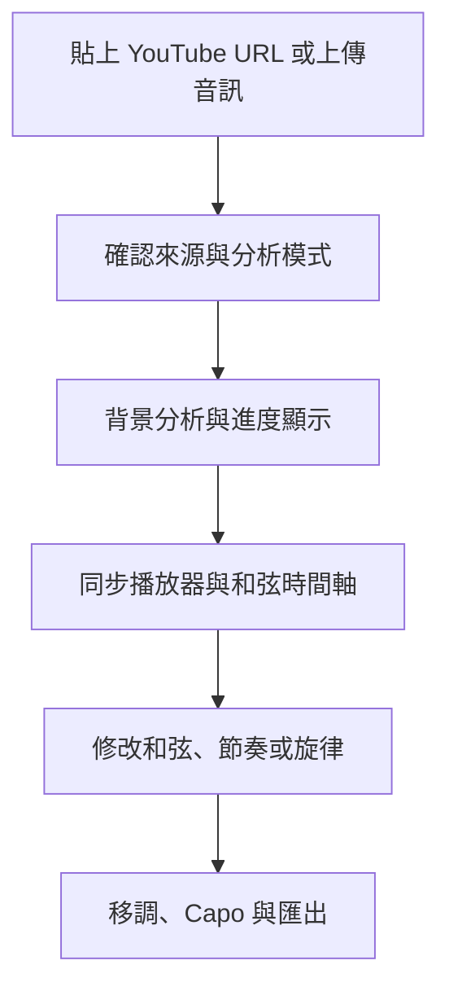
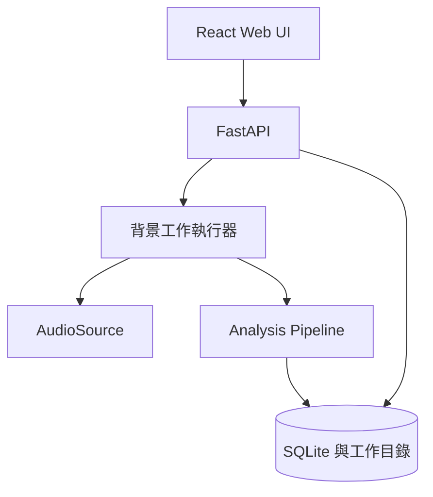

# GuitarScribe Web UI 開發交接文件

> 文件用途：讓下一個 AI Session 或 Coding Agent 不需要依賴先前對話，即可完整接手規劃、實作、測試與後續迭代。  
> 文件狀態：產品方向已確認，尚未建立程式碼專案。  
> 建立日期：2026-09-04  
> 目標平台：Ubuntu 開發環境、Docker 化 Web 應用程式

---

## 1. 專案摘要

專案暫名為 **GuitarScribe**。

使用者希望得到一個 Web UI 工具：只要提供 YouTube 連結，系統就能分析歌曲，產生適合吉他練習的：

1. 和弦譜；
2. BPM、拍號、小節與主要節奏骨架；
3. 建議刷奏節奏；
4. 簡化主旋律；
5. 可選的吉他單音六線譜；
6. 可播放、同步、修正與匯出的結果。

本產品不是第一版就還原完整錄音中的每一個吉他音符、技巧與原始指法。核心價值是快速產生一份「能跟著歌曲彈唱或練習」的可編輯初稿。

一句話產品定義：

> 貼上歌曲連結，取得與原曲同步的和弦、小節、節奏建議及簡化主旋律，並能人工修正及匯出。

---

## 2. 已確認的產品決策

以下決策視為目前基線，後續 Session 不應在沒有明確理由時重新推翻。

### 2.1 第一版要做

- Web UI。
- YouTube URL 輸入欄位。
- 本機音訊檔上傳，作為開發、測試及合法替代來源。
- 取得歌曲標題、長度與縮圖等基本資訊。
- 分析調性、BPM、拍點、拍號與小節。
- 分析帶時間範圍的和弦序列。
- 將和弦切換吸附到合理拍點。
- 將過短、低可信度的和弦誤判合併。
- 提供簡易、標準、完整三種和弦顯示層級。
- 建議 Capo 與移調。
- 產生主要節奏格及建議刷奏型。
- 擷取簡化的單音主旋律。
- 將主旋律映射成一組合理且容易演奏的吉他弦位與琴格。
- YouTube 嵌入播放器或音訊播放器與譜面同步。
- 使用者可手動修改和弦、節拍及旋律音符。
- 匯出 JSON、ChordPro；PDF 和 MusicXML 可在後續里程碑加入。
- 背景分析工作、進度顯示、錯誤訊息與暫存檔清除。

### 2.2 第一版不做

- 不精確還原完整節奏吉他軌。
- 不保證判斷原吉他手每次上刷或下刷。
- 不還原推弦、滑音、顫音、悶音、泛音等完整技巧。
- 不建立完整多軌總譜。
- 不自動抓取、重製或長期保存歌詞。
- 不提供大規模歌曲庫、公開分享市場或商業音樂下載服務。
- 不承諾所有曲風均有相同準確率。
- 不將任何特定辨識模型寫死在 API 或 UI 層。

### 2.3 「主要節奏」的定義

第一版的主要節奏包含：

- BPM；
- 拍號；
- 拍點與強拍；
- 小節線；
- 和弦在第幾拍切換；
- 四分、八分或十六分音符層級的節奏密度；
- 重音位置；
- 一組可搭配歌曲的建議刷奏型。

建議刷奏型是「可用的伴奏建議」，不是對原始右手動作的逐次辨識。

### 2.4 「簡化主旋律」的定義

使用者可選擇：

- 人聲主旋律；
- 吉他 Lead／間奏旋律；
- 全曲最明顯的單音旋律。

MVP 預設為「人聲主旋律」。只保留主要音高、開始時間、大致音長與基本節奏，省略短促裝飾音、和聲人聲及低可信度音符。

---

## 3. 法律與來源限制

### 3.1 YouTube 限制

YouTube 服務條款限制未經服務明示授權或權利人同意的下載與自動化存取。正式產品不可假設「公開可觀看」等於「可由伺服器下載並處理」。

因此系統必須把音訊來源抽象化，不可將 `yt-dlp` 散落在業務邏輯中。

```python
class AudioSource(Protocol):
    async def resolve(self, request: SourceRequest) -> AudioAsset:
        ...
```

建議支援兩種部署模式：

1. **個人本機模式**：使用者確認內容為自己擁有、公共領域或已獲授權後，啟用可選的 YouTube resolver。
2. **公開服務模式**：YouTube URL 主要用於 metadata 與嵌入播放器；分析音訊改由使用者合法上傳，或由已授權的媒體來源提供。

產品介面應提供簡短的權利確認，不應聲稱工具能合法下載任何 YouTube 內容。

參考：<https://www.youtube.com/static?template=terms>

### 3.2 歌詞

第一版不抓取歌詞。若未來加入，應採以下其中一種方式：

- 使用者自行貼上；
- 使用者上傳自己有權使用的歌詞；
- 接入有授權的歌詞供應商。

---

## 4. 目標使用流程



### 4.1 首頁

首頁至少包含：

- YouTube URL 輸入欄位；
- 音訊檔上傳；
- 分析模式：人聲旋律／吉他旋律／只分析和弦；
- 和弦複雜度：簡易／標準／完整；
- 吉他調弦：MVP 固定標準調弦 E–A–D–G–B–E；
- 權利確認；
- 「開始分析」按鈕。

### 4.2 分析進度頁

顯示可理解的階段，不顯示底層模型術語：

1. 準備音訊；
2. 尋找拍點與小節；
3. 辨識和弦；
4. 擷取主旋律；
5. 整理成吉他譜。

應能處理失敗、取消及逾時。重新整理頁面後，可使用工作 ID 恢復進度。

### 4.3 結果與編輯頁

建議桌面版畫面：

- 上方：歌曲標題、調性、BPM、拍號、Capo、移調控制。
- 左上或上方：YouTube／音訊播放器。
- 中央：以小節為單位的和弦格。
- 下方：波形或時間軸、拍點、和弦區段、旋律音符。
- 側欄：和弦指法、可信度、簡化選項與錯誤提示。

互動要求：

- 播放游標與譜面同步。
- 點擊小節、和弦或音符可跳到對應時間。
- 雙擊和弦可修改名稱。
- 可拖曳和弦邊界。
- 可新增、刪除或分割和弦區段。
- 可調整小節起點與拍點。
- 修改結果不應被重新分析直接覆蓋。
- 原始模型結果與使用者修正版要分開保存。

### 4.4 匯出

MVP：

- JSON：完整分析資料與時間戳。
- ChordPro：和弦與段落用途。

後續：

- PDF：列印與平板閱讀。
- MusicXML：主旋律與簡化 Tab。
- MIDI：主旋律播放與外部編輯。

ChordPro 參考：<https://www.chordpro.org/>

---

## 5. 建議系統架構



### 5.1 推薦技術

| 層級 | 建議 |
| --- | --- |
| 前端 | React、TypeScript、Vite |
| 樣式 | Tailwind CSS 或簡單 CSS Modules |
| 後端 | Python 3.10、FastAPI、Pydantic |
| 工作執行 | MVP 使用獨立 worker process；多人版改 Redis + RQ/Celery |
| 音訊 | FFmpeg、soundfile、librosa 或 Essentia |
| 和弦 | Chordino adapter 起步，保留替換模型能力 |
| 旋律 | Basic Pitch 起步，必要時搭配分軌模型 |
| 分軌 | 可選 adapter；不可成為和弦 MVP 的強制依賴 |
| 樂譜顯示 | alphaTab，用於 MusicXML／六線譜階段 |
| 儲存 | MVP 使用 SQLite；音訊只放暫存工作目錄 |
| 測試 | pytest、Playwright、Vitest |
| 部署 | Docker Compose |

### 5.2 Python 版本與 Chordino

先前人工從 Vamp Plugins 下載 Chordino 已失敗。下一個 Session 不應再次要求使用者手動安裝插件。

推薦做法：

- 用 Python 3.10 Docker image 固定舊音訊套件相依性；
- 在 Docker build 階段安裝、編譯或封裝 Chordino；
- 或使用包含 Linux 64-bit Chordino binary 的 Python wrapper 作為技術驗證；
- 在 CI 中執行插件載入 smoke test；
- `ChordAnalyzer` 必須允許未來替換成其他模型。

若 Chordino 在現代環境仍不穩定，應更換 adapter，不應讓整個產品被單一舊插件卡住。

### 5.3 Demucs 注意事項

Demucs v4 提供實驗性六音軌模型，可分離 guitar 和 piano，但原始 Meta repository 已封存，且吉他音軌可能有 bleed 和 artifacts。它只能作為可替換的後處理選項，不能成為 MVP 的唯一核心。

參考：<https://github.com/facebookresearch/demucs>

### 5.4 Basic Pitch 注意事項

Basic Pitch 可將音訊轉為 MIDI／音符事件並支援複音，但在一次分析單一樂器時效果較佳。因此：

- 人聲旋律模式最好使用 vocal stem；
- 吉他旋律模式最好使用 guitar stem；
- 若分軌失敗，必須回退為全混音顯著旋律，並降低 confidence。

參考：<https://github.com/spotify/basic-pitch>

### 5.5 alphaTab

alphaTab 適合後續顯示標準譜、吉他 Tab、MusicXML 與 Guitar Pro 類型資料，也能同步真實音訊／影片。

參考：<https://docs.alphatab.net/>

---

## 6. 模組界面

不可讓 API handler 直接呼叫 FFmpeg、Chordino 或 Basic Pitch。建議核心界面如下。

```python
class AudioSource(Protocol):
    async def resolve(self, request: SourceRequest) -> AudioAsset: ...

class AudioPreprocessor(Protocol):
    async def normalize(self, asset: AudioAsset) -> NormalizedAudio: ...

class BeatAnalyzer(Protocol):
    async def analyze(self, audio: NormalizedAudio) -> BeatAnalysis: ...

class ChordAnalyzer(Protocol):
    async def analyze(self, audio: NormalizedAudio) -> ChordAnalysis: ...

class MelodyAnalyzer(Protocol):
    async def analyze(
        self,
        audio: NormalizedAudio,
        mode: MelodyMode,
    ) -> MelodyAnalysis: ...

class RhythmSuggester(Protocol):
    def suggest(
        self,
        beats: BeatAnalysis,
        chords: ChordAnalysis,
        audio_features: AudioFeatures,
    ) -> RhythmSuggestion: ...

class FretboardMapper(Protocol):
    def map(self, melody: MelodyAnalysis, tuning: GuitarTuning) -> GuitarTab: ...

class ScoreExporter(Protocol):
    async def export(self, score: SongScore, format: ExportFormat) -> ExportAsset: ...
```

每個 analyzer 都必須回傳：

- 引擎名稱與版本；
- 輸入設定；
- 產生時間；
- confidence；
- warnings；
- 結果資料。

---

## 7. 分析管線

### 7.1 音訊準備

標準化目標：

- WAV；
- 44.1 kHz；
- float 或 PCM 16-bit，依模型需求；
- 保留單聲道分析版本；
- 必要時另保留立體聲播放版本；
- 記錄原始與標準化 duration，檢查時間偏移。

所有外部命令必須：

- 使用 argument array，不拼接 shell 字串；
- 設定逾時；
- 限制最大檔案大小與最長歌曲時間；
- 驗證 MIME、codec 與實際 duration；
- 將每個工作隔離在獨立目錄；
- 完成、取消或失敗後清除暫存音訊。

### 7.2 拍點與小節

輸出至少包含：

- tempo candidates；
- selected BPM；
- beat timestamps；
- downbeat timestamps；
- time signature；
- measure boundaries；
- confidence。

必須處理 half-time／double-time，例如模型輸出 70 BPM 但歌曲可感知為 140 BPM。UI 應允許使用者切換 0.5×／1×／2× 並重新產生小節。

### 7.3 和弦辨識

原始模型輸出不可直接呈現。建議後處理順序：

1. 正規化 enharmonic spelling，例如依歌曲調性選擇 `Bb` 或 `A#`。
2. 去除極短區段。
3. 依相鄰 confidence 合併低可信度區段。
4. 吸附到最近拍點或半拍點。
5. 合併連續相同和弦。
6. 避免平滑跨越明顯強拍或段落邊界。
7. 產生完整與簡化版本。

簡化例：

| 完整 | 標準 | 簡易 |
| --- | --- | --- |
| Cmaj9 | Cmaj7 | C |
| G7sus4 | G7 | G |
| D/F# | D/F# | D |
| Am(add9) | Am | Am |

### 7.4 節奏建議

第一版不直接聲稱辨識真實上／下刷。建議演算法：

1. 從 beat/downbeat 建立小節網格。
2. 計算 onset strength 與重音分布。
3. 判斷節奏細分為四分、八分或十六分。
4. 從有限模板庫選擇最接近的刷奏型。
5. 依歌曲速度與複雜度產生簡易／標準版本。

模板資料應與程式碼分離，例如：

```json
{
  "id": "pop_4_4_8th_01",
  "time_signature": "4/4",
  "subdivision": 8,
  "events": ["D", null, "D", "U", null, "U", "D", "U"],
  "accents": [1.0, 0.0, 0.7, 0.4, 0.0, 0.5, 0.8, 0.4]
}
```

UI 文案要寫「建議刷奏」，避免誤導為原曲精確轉錄。

### 7.5 主旋律

後處理：

- 依 mode 選擇 vocal/guitar/mix input；
- 移除低 confidence 音符；
- 移除極短音符；
- 合併同音連續片段；
- 對齊合理節奏網格；
- 限制跳進造成的假音；
- 可參考調性但不可強制刪除所有非調內音；
- 保留原始音高結果供 debug。

### 7.6 吉他指板映射

MVP 使用標準調弦。每個 MIDI pitch 先列出所有可能的弦／格，再用動態規劃或最短路徑選出整段成本最低的配置。

成本函數可以包含：

```text
cost =
  position_shift_weight * 琴格位移
  + string_jump_weight * 跨弦數
  + high_fret_weight * 高把位懲罰
  + stretch_weight * 手位跨度
  + open_string_preference * 空弦偏好
```

需允許重新映射：

- 最容易彈；
- 偏好低把位；
- 偏好單一弦；
- 指定最高琴格。

---

## 8. 核心資料模型

建議以 `SongScore` 作為前後端、資料庫與匯出的 canonical model。

```json
{
  "schema_version": "1.0",
  "song": {
    "title": "Example Song",
    "source_type": "youtube",
    "source_url": "https://youtube.com/watch?v=...",
    "duration_seconds": 213.4
  },
  "analysis": {
    "key": "G",
    "mode": "major",
    "bpm": 92.0,
    "time_signature": "4/4",
    "capo": 2,
    "confidence": 0.81,
    "warnings": []
  },
  "beats": [
    {"time": 0.52, "beat": 1, "measure": 1, "confidence": 0.93}
  ],
  "chords": [
    {
      "id": "chord-1",
      "start": 0.52,
      "end": 4.68,
      "symbol": "G",
      "confidence": 0.84,
      "origin": "model",
      "edited": false
    }
  ],
  "melody": [
    {
      "id": "note-1",
      "start": 1.04,
      "end": 1.56,
      "midi": 71,
      "note": "B4",
      "confidence": 0.78,
      "string": 2,
      "fret": 0,
      "origin": "model",
      "edited": false
    }
  ],
  "rhythm": {
    "subdivision": 8,
    "pattern_id": "pop_4_4_8th_01",
    "display": ["D", null, "D", "U", null, "U", "D", "U"],
    "confidence": 0.66,
    "label": "建議刷奏"
  },
  "provenance": {
    "beat_engine": "example@1.0",
    "chord_engine": "example@1.0",
    "melody_engine": "example@1.0"
  }
}
```

重要原則：

- `origin=model` 與 `origin=user` 要能區分。
- 人工修改後設定 `edited=true`。
- 重新分析時預設建立新 revision，不覆蓋人工修改。
- 所有時間一律用秒，以原始播放媒體時間軸為準。
- API、資料庫與匯出格式都要帶 `schema_version`。

---

## 9. 建議 API

```text
POST   /api/v1/jobs
GET    /api/v1/jobs/{job_id}
POST   /api/v1/jobs/{job_id}/cancel

GET    /api/v1/scores/{score_id}
PATCH  /api/v1/scores/{score_id}
POST   /api/v1/scores/{score_id}/reanalyze
POST   /api/v1/scores/{score_id}/transpose
POST   /api/v1/scores/{score_id}/remap-fretboard

GET    /api/v1/scores/{score_id}/exports/json
GET    /api/v1/scores/{score_id}/exports/chordpro
GET    /api/v1/scores/{score_id}/exports/pdf
GET    /api/v1/scores/{score_id}/exports/musicxml
```

建立工作範例：

```json
{
  "source": {
    "type": "youtube",
    "url": "https://youtube.com/watch?v=...",
    "rights_confirmed": true
  },
  "options": {
    "melody_mode": "vocal",
    "chord_complexity": "standard",
    "tuning": "EADGBE",
    "max_duration_seconds": 600
  }
}
```

工作狀態：

```text
queued → resolving → preprocessing → beat_analysis
→ chord_analysis → melody_analysis → postprocessing
→ exporting → completed
```

終止狀態：`completed`、`failed`、`cancelled`、`expired`。

---

## 10. 建議目錄結構

```text
guitarscribe/
├── README.md
├── docker-compose.yml
├── .env.example
├── backend/
│   ├── Dockerfile
│   ├── pyproject.toml
│   ├── app/
│   │   ├── api/
│   │   ├── core/
│   │   ├── models/
│   │   ├── sources/
│   │   ├── analyzers/
│   │   │   ├── beats/
│   │   │   ├── chords/
│   │   │   └── melody/
│   │   ├── postprocess/
│   │   ├── fretboard/
│   │   ├── exporters/
│   │   ├── jobs/
│   │   └── main.py
│   └── tests/
├── frontend/
│   ├── Dockerfile
│   ├── package.json
│   ├── src/
│   │   ├── api/
│   │   ├── components/
│   │   ├── features/
│   │   │   ├── source-input/
│   │   │   ├── analysis-job/
│   │   │   ├── score-editor/
│   │   │   └── exports/
│   │   └── pages/
│   └── tests/
├── contracts/
│   ├── song-score.schema.json
│   └── api.openapi.json
├── rhythm-patterns/
├── fixtures/
│   ├── audio/
│   └── annotations/
└── docs/
    ├── architecture.md
    ├── legal-and-source-policy.md
    └── evaluation.md
```

測試音訊必須是自製、公共領域或明確可再散布的短片段，不可把受版權保護的商業歌曲提交到 repository。

---

## 11. 測試與準確率評估

### 11.1 Golden dataset

先準備 10～20 個可合法使用的短音訊片段，包含：

- 原音吉他＋單一人聲；
- 標準四和弦流行歌；
- 3/4 或 6/8；
- 切分音；
- 有轉位和弦的歌曲；
- 鼓與貝斯較重的混音；
- 無人聲的吉他旋律；
- half-time／double-time 容易混淆的歌曲。

每首應有人工作為 ground truth：

- BPM；
- 拍號；
- beat/downbeat；
- 和弦與切換時間；
- 簡化主旋律 MIDI notes。

### 11.2 建議指標

- BPM 誤差與 half/double tempo 命中率。
- Beat F-measure，使用固定時間容許範圍。
- Downbeat F-measure。
- Chord symbol recall 或 weighted chord symbol recall。
- Chord boundary timing error。
- Melody onset F-measure。
- Melody pitch accuracy。
- 使用者修正次數／每分鐘歌曲。
- 完成一份可彈譜所需時間。

不應只用「程式成功執行」作為驗收。最終產品指標應是：使用者是否能在少量修正後跟著歌曲彈奏。

### 11.3 非功能測試

- 不合法 URL。
- 私人、區域限制或已刪除影片。
- 影片過長。
- 無音訊軌。
- FFmpeg 失敗。
- worker 重啟。
- 使用者取消。
- 相同歌曲重複分析。
- 暫存檔是否確實清除。
- API 路徑注入與任意 shell argument。
- 同時工作數與記憶體限制。

---

## 12. 安全、隱私與資源限制

- 所有外部輸入皆視為不可信。
- 不把 URL 或檔名直接插入 shell command。
- 工作目錄使用隨機 job ID。
- 禁止路徑穿越。
- 限制檔案大小、duration、取樣率及解碼時間。
- worker 使用 CPU、RAM、磁碟與執行時間限制。
- 暫存音訊設定 TTL。
- 預設不長期保存來源音訊。
- 日誌不得包含 cookie、授權 header 或完整憑證。
- 若 resolver 需要登入，不在 MVP 收集使用者 YouTube 密碼。
- 公開部署時加入 rate limiting。
- 匯出檔名必須清理特殊字元。

---

## 13. 開發里程碑

### Milestone 0：技術 Spike

目標：證明核心模型可在固定 Docker 環境中運作。

交付：

- 本機音訊輸入；
- FFmpeg 標準化；
- BPM／beat 分析；
- Chordino 或替代引擎；
- Basic Pitch 或替代引擎；
- JSON 輸出；
- 一個端對端測試。

通過條件：在乾淨 Ubuntu 主機只需 Docker，即可對合法測試音訊產生結果。

### Milestone 1：後端 MVP

交付：

- FastAPI；
- 建立、查詢、取消工作；
- 背景 worker；
- SQLite；
- AudioSource abstraction；
- 本機上傳來源；
- 可選 YouTube resolver；
- 暫存清除；
- OpenAPI 文件。

### Milestone 2：Web UI MVP

交付：

- URL／上傳首頁；
- 分析選項；
- 工作進度；
- 結果頁；
- 播放器同步；
- 和弦格與拍點；
- JSON／ChordPro 匯出。

### Milestone 3：可編輯樂譜

交付：

- 和弦修改；
- 邊界拖曳；
- 拍點與小節修正；
- 原始與修正版 revision；
- 移調與 Capo；
- 和弦指法圖；
- 建議刷奏型。

### Milestone 4：簡化主旋律與 Tab

交付：

- Melody mode；
- 音符清理與量化；
- 指板映射；
- alphaTab 顯示；
- MusicXML／MIDI 匯出。

### Milestone 5：品質與部署

交付：

- Golden dataset 評估報告；
- 失敗案例分類；
- E2E 測試；
- 資源限制；
- 可觀測性；
- 部署文件；
- 備份與資料保留政策。

---

## 14. MVP Definition of Done

MVP 完成必須同時符合：

- 使用者可以在 Web UI 貼上合法來源或上傳音訊。
- 系統顯示可恢復的背景分析進度。
- 結果包含 BPM、拍號、拍點、小節、調性及和弦。
- 和弦已完成節拍吸附及短誤判平滑。
- 播放器與和弦時間軸同步。
- 使用者能修改和弦及時間邊界。
- 可移調並取得 Capo 建議。
- 顯示一組明確標示為「建議」的刷奏節奏。
- 可匯出 JSON 與 ChordPro。
- 失敗訊息具體且可採取行動。
- 暫存音訊在規定時間內清除。
- 在新的 Ubuntu 主機上可使用 Docker Compose 啟動。
- 核心 pipeline 有自動測試。
- README 記錄所有已知限制。

主旋律／Tab 可以在 Milestone 4 完成，不應阻止和弦 Web MVP 先交付。

---

## 15. 下一個 AI Session 的執行順序

下一個 Session 接手後，應依序執行：

1. 檢查目前 workspace 是否已存在 repository 或使用者新增的檔案。
2. 若沒有 repository，先建立專案骨架、README、Docker Compose 與資料契約。
3. 先完成本機音訊 CLI spike，不要一開始同時建立完整前端。
4. 驗證 Chordino 在 container 中是否可重現安裝。
5. 若 Chordino 安裝在限定時間內仍失敗，依 `ChordAnalyzer` 介面換用替代引擎並記錄差異。
6. 用合法短音訊 fixture 建立端對端測試。
7. pipeline 通過後才建立 FastAPI job API。
8. API 穩定後建立 React Web UI。
9. 先交付和弦與節拍，再加入主旋律與 Tab。
10. 每個里程碑都更新本文件中的狀態、已知問題與下一步。

禁止事項：

- 不要把模型安裝步驟留給終端使用者。
- 不要把 YouTube resolver 寫死在分析 pipeline。
- 不要將模型原始輸出直接當成最終譜面。
- 不要先製作漂亮 UI，卻沒有可回歸測試的分析核心。
- 不要提交商業歌曲音訊到 Git repository。
- 不要在沒有清理與人工編輯功能的情況下宣稱輸出準確。

---

## 16. 第一個 Coding Agent 任務提示詞

```text
你正在接手 GuitarScribe 專案。

請先完整閱讀 GuitarScribe_Web_UI_AI_Handoff.md，並將其中的已確認產品決策視為目前基線。

本次只完成 Milestone 0：技術 Spike。

目標：
在 Ubuntu 上使用 Docker，輸入一個合法的本機 WAV/MP3 音訊，輸出包含 BPM、拍點、拍號候選、調性、帶時間戳和弦及簡化主旋律候選的 JSON。

要求：
1. 使用 Python 3.10、Docker 與 FFmpeg。
2. 建立 AudioPreprocessor、BeatAnalyzer、ChordAnalyzer、MelodyAnalyzer 介面。
3. 所有模型實作只能存在 adapters/analyzers 層，不可寫進 CLI 或 API。
4. 優先驗證 Chordino，但不可要求使用者手動從 Vamp 網站下載插件。
5. 若 Chordino 在固定 Docker 環境無法可靠安裝，建立替代引擎並記錄技術決策。
6. 主旋律可先使用 Basic Pitch；保留原始音符與清理後音符。
7. 定義並驗證 SongScore JSON Schema。
8. 建立 pytest 單元測試及至少一個端對端測試。
9. 測試 fixture 必須是自製或可合法再散布的短音訊。
10. 提供 make 或 task 指令，至少包含 build、test、analyze。
11. README 提供從全新 Ubuntu 環境開始的完整操作指令。
12. 不建立 Web UI，不實作未授權 YouTube 下載，不加入歌詞。

完成後請回報：
- 新增或修改的檔案；
- 實際執行的測試；
- 範例 JSON；
- Chordino 是否成功；
- 已知限制；
- Milestone 1 的建議工作拆分。
```

---

## 17. 待確認但不阻塞 Milestone 0 的事項

以下問題可在 Web UI 開始前由使用者確認：

- 產品主要是個人本機使用，還是未來要公開部署？
- 第一版歌曲長度上限要設 5、10 還是 20 分鐘？
- 主旋律預設要人聲，還是讓使用者每次選擇？
- 界面主要使用繁體中文，是否也需要英文？
- PDF 要偏向彈唱和弦表，還是和弦＋單音旋律的教材版？
- 是否需要登入與跨裝置保存？
- 使用者修改後的資料是否需要成為未來模型評估資料？若需要，必須另行取得同意。

在沒有新答案前，建議預設：

- 個人本機／單使用者模式；
- 最長 10 分鐘；
- 預設人聲主旋律；
- 繁體中文 UI；
- PDF 偏向容易彈唱；
- 不登入；
- 修正資料只保存在本機，不用於訓練。

---

## 18. 產品原則

1. **先可彈，再求完整。**
2. **模型輸出必須可編輯。**
3. **節拍對齊與後處理和模型本身同樣重要。**
4. **所有分析引擎都必須可替換。**
5. **音訊來源與分析核心必須解耦。**
6. **不把建議刷奏冒充為原曲精確刷法。**
7. **不長期保存來源音訊。**
8. **以少量修正後能跟著原曲彈奏，作為真正成功標準。**

